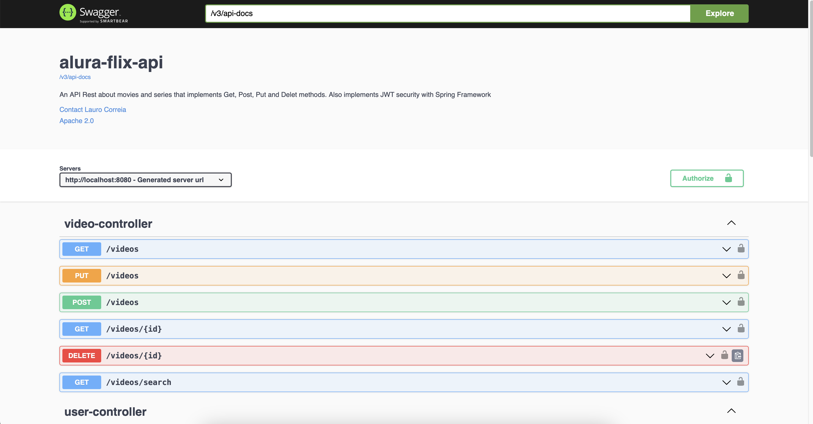
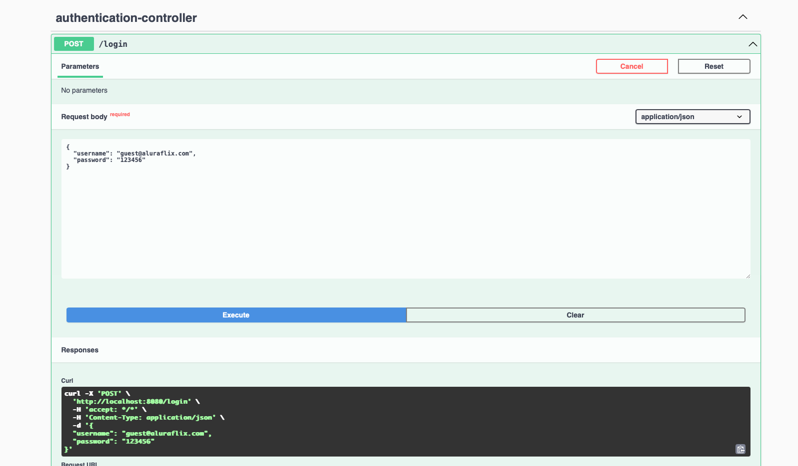
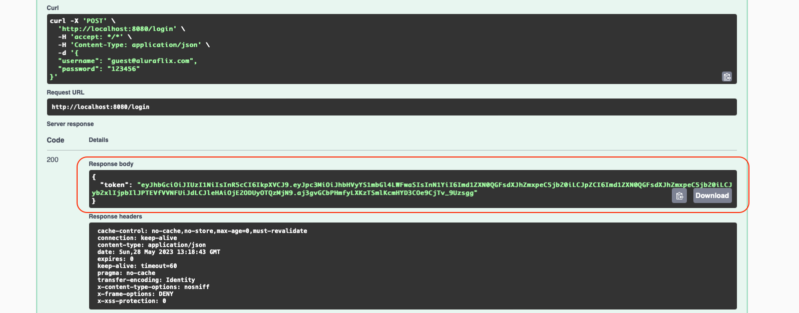

# alura-flix-api

This is an application with aim to learning about new features of Spring security from Spring version 6.
The application is available at: alura-flix-api-production.up.railway.app


## About this project
* [About](#about)
* [Technologies](#Technologies)
* [How to run](#how-to-run)
* [Authentication](#login)
* [Contributors](#contributors)

# About 
This is an application with aim to learning about new features of Spring security from Spring version 6.
It is possible to access swagger documentation throught url: [http://localhost:8080/swagger-api](http://localhost:8080/swagger-ui/index.html).

The username for test is: guest@aluraflix.com and the password is: 123456, please notice this user has ROLE_USER.



# Technologies
- Java 17
- Spring boot 3
- Spring 6
- Mongo Atlas
- Lombok
- Spring Security
- JWT Token library
- Docker 

# How to Run
<p>Go to the directory docker-compose/docker-compose.yml and execute<p/>

```shell
docker-compose up
```

#### Login
<p>In the authentication-controller use the credentials<p/>
<p>username: guest@aluraflix.com / password: 123456 to log in.<p/>



<p>After that copy the Token JWT<p/>



<p>And paste it in the Authorize button<p/>


That's it, you are already logged and can try out all endpoints :wink:

## Contributors
[@LauroSilveira](https://github.com/LauroSilveira)

<p>Fell free to fork and contribute :wink:<p/>
